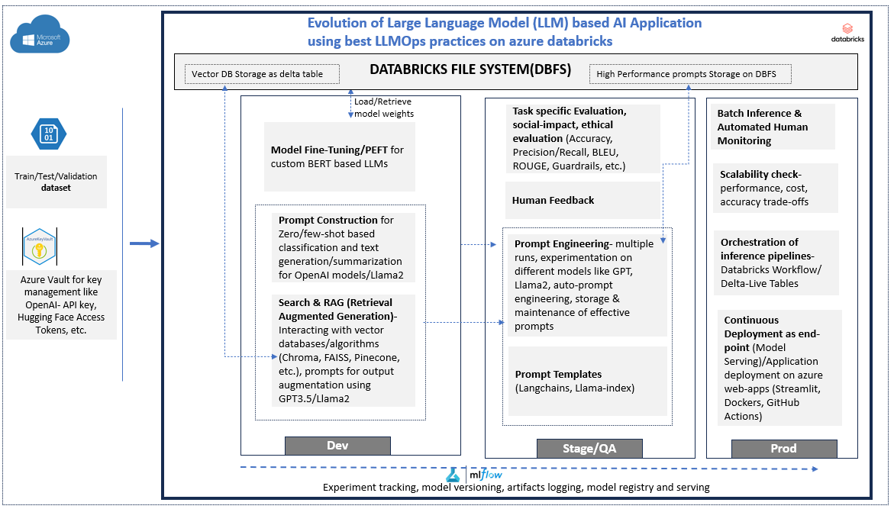

# hands-on-LLMs
This repo covers the entire workflow from developing/fine-tuning Large Language models for text classification & summarization, making inferences and evaluation and then deploying to production using Mlflow as part of LLMOps

# Enviornment:
Azure Databricks

# Architecture

# Content:
* LLM introduction and Databricks
* Applications with LLMs- Classification and Generative AI using Hugging Face pre-trained models like T5-small/base
* Embeddings, Vector Databases, and Search
* Multi-Stage Reasoning (LLM chains, Prompts, Agents, Langchain)
* Fine-Tuning (Traditional fine-tuning, PEFT, Instruct-finetuning, RLHF)
* Task-Specific Evaluation (Accuracy, Precision, Recall, Rouge Score, BLEU)
* Ethical Evaluation & Biasness- Impact on society(Risks, Toxicity, Hallucinations, Mitigation)
* LLMOPs (MLOPs vs LLMOPs, model loading, Inference pipeline- Delta Tables, MLFLOW (experiment tracking & Model Registry), Orchestration using Delta Live Tables, Deployment to production from dev pipelines.)

